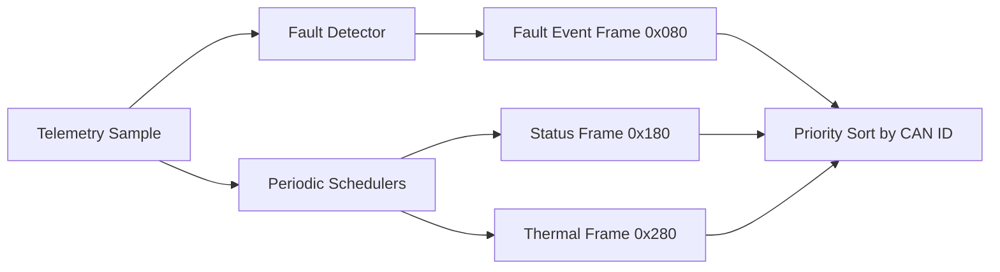

# CAN Telemetry Node Architecture

## Overview

This project simulates a CAN telemetry publisher that emits periodic status
frames, lower-rate thermal frames, and immediate fault events ordered by CAN ID
priority.



## Core Modules

- `telemetry_node.c`: schedules frames and encodes payloads
- `can_frame.c`: formats frames in a SocketCAN-style text view
- `main.c`: replays changing system conditions on a host machine

## Typical Run

```text
tick=2 emitted=3
  vcan0 080 [2] 07 00 00 00 00 00 00 00
  vcan0 180 [6] 60 04 1E 00 D4 02 00 00
  vcan0 280 [4] 16 03 07 00 00 00 00 00
tick=4 emitted=2
  vcan0 080 [2] 00 00 00 00 00 00 00 00
  vcan0 180 [6] C0 12 28 00 CD 02 00 00
```

## Interview Value

- Shows deterministic message scheduling instead of ad-hoc printing
- Demonstrates CAN ID priority and compact payload packing
- Creates a clean bridge to Linux `vcan` or real MCP2515 hardware

