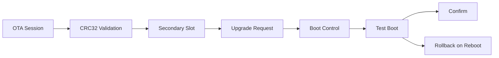

# OTA Bootloader Simulator Architecture

## Overview

This project models a small A/B firmware-update flow. Images are received in
chunks, validated with CRC32, staged into a secondary slot, then activated in
test or permanent mode.



## Core Modules

- `ota_session.c`: receives image chunks and verifies total size
- `crc32.c`: computes image integrity checksum
- `boot_control.c`: manages primary/secondary slots and rollback behavior
- `main.c`: simulates factory, trial, rollback, and permanent update flows

## Typical Run

```text
factory: v1.0.0 crc=19A140E2 size=16 confirmed=1
after test upgrade reboot: v1.1.0 crc=4CE93DFC size=22 confirmed=0
reboot without confirm: v1.0.0 crc=19A140E2 size=16 confirmed=1
after permanent upgrade reboot: v1.2.0 crc=0E7C2932 size=27 confirmed=1
final reboot: v1.2.0 crc=0E7C2932 size=27 confirmed=1
```

## Interview Value

- Shows firmware update reliability thinking
- Makes rollback and confirmation rules explicit and testable
- Creates a direct path toward MCUboot or Zephyr integration work

