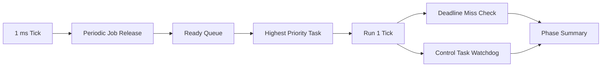

# RTOS Scheduler Lab Architecture

## Overview

This project models a fixed-priority preemptive scheduler for periodic embedded
tasks. Jobs are released on period boundaries, run by priority, checked for
deadline misses, and observed by a watchdog tied to the control task.

## Core Modules

- `scheduler.c`: release, dispatch, execute, deadline check, and watchdog logic
- `task_catalog.c`: phase-specific task-set definitions
- `main.c`: deterministic phase replay

## Embedded Value

- Demonstrates real-time scheduling rather than only event handling
- Makes timing failures visible in a compact trace
- Creates a bridge to RTOS trace tooling and hardware timing instrumentation

