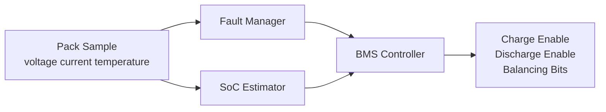

# Smart BMS Firmware Architecture

## Overview

This project models a compact battery-management controller with fault
evaluation, state transitions, coulomb-counting based state-of-charge tracking,
and a simple cell-balancing decision.



## Core Modules

- `fault_manager.c`: evaluates voltage, temperature, current, and imbalance limits
- `soc_estimator.c`: updates state of charge from current and elapsed time
- `bms_controller.c`: chooses the operating state and balancing behavior
- `main.c`: replays deterministic pack scenarios as a host-side demo

## Typical Run

```text
step=0 state=IDLE soc=72.00 charge=1 discharge=1 faults=none balancing=[0 0 0 0]
step=1 state=CHARGING soc=72.02 charge=1 discharge=0 faults=none balancing=[0 0 0 1]
step=2 state=CHARGING soc=72.03 charge=1 discharge=0 faults=none balancing=[0 0 0 1]
step=3 state=DISCHARGING soc=72.00 charge=0 discharge=1 faults=none balancing=[0 0 0 0]
step=4 state=FAULT soc=72.00 charge=0 discharge=0 faults= overtemp balancing=[0 0 0 0]
```

## Interview Value

- Shows state-machine thinking instead of only linear sensor reads
- Demonstrates safety gating and latched fault response
- Gives a clean path toward STM32 or ESP32 ADC and GPIO integration

