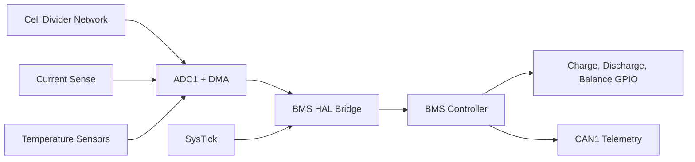

# STM32F446 Port Block Diagram

## Porting Notes

- Keep the controller logic platform-agnostic and let the HAL bridge own scaling.
- Use DMA-backed ADC sampling so the control step reads a coherent snapshot.
- Publish critical faults over CAN before toggling contactor outputs.

